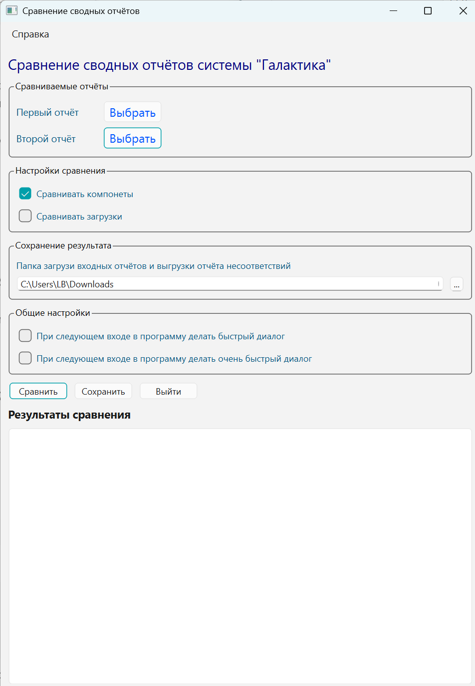
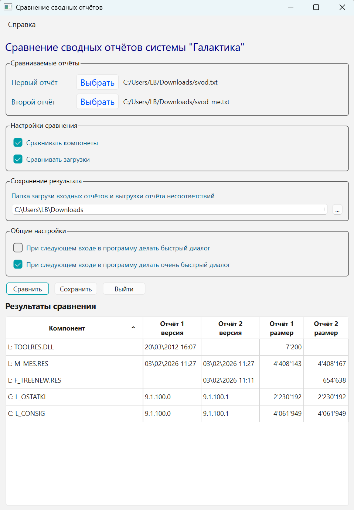
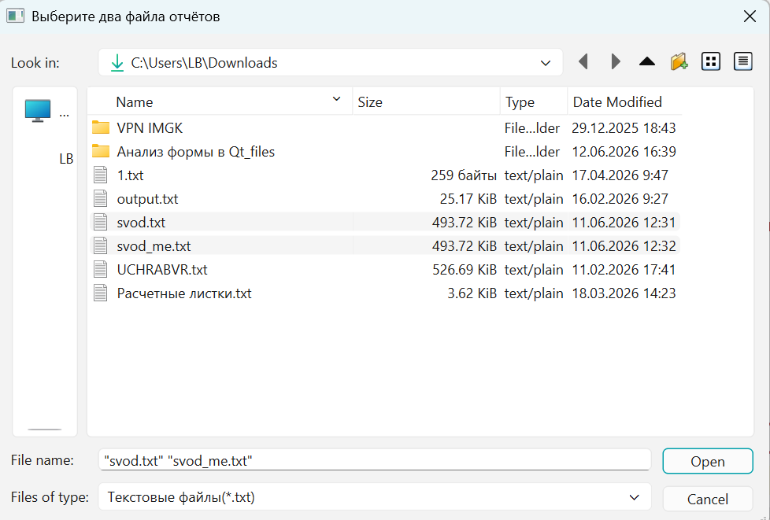

# Compare Reports

Программа предназначена для поиска различий между двумя установками системы
«Галактика».

Для анализа используются специализированные отчёты системы:

- сводный отчёт о компонентах;
- полный отчёт о компонентах;
- отчёт о рабочей станции.

За один запуск программы сравнивается один тип отчёта, полученный с двух разных
установок системы.

На основании данных отчёта программа определяет различия в установленных
компонентах и загруженных модулях, включая версии, даты и размеры файлов.

## Основные возможности

- сравнение компонентов и загруженных модулей двух установок системы;
- сортировка результатов сравнения по любому столбцу;
- быстрый режим выбора отчётов;
- сверхбыстрый режим выбора двух отчётов в одном диалоге;
- сохранение результатов в CSV-файл, открываемый в Microsoft Excel;
- настройка папки сохранения результатов.

## Особенности программы

Основное внимание при разработке уделялось удобству работы пользователя.

Для выполнения сравнения достаточно выбрать два файла отчётов и нажать кнопку
**«Сравнить»**. В быстрых режимах количество действий пользователя
дополнительно сокращается.

Для удобства анализа результатов реализованы:

- сортировка данных по столбцам;
- автоматическое изменение ширины колонок;
- выравнивание числовых данных;
- сохранение результатов в формате CSV для дальнейшей обработки в Microsoft
  Excel.

## Скриншоты

### Главное окно программы



### Результат сравнения



### Сверхбыстрый режим выбора отчётов



## Запуск из исходного кода

Создайте виртуальное окружение и установите зависимости:

```powershell
py -3.13 -m venv .venv
.\.venv\Scripts\Activate.ps1
python -m pip install -r requirements.txt
```

Запустите программу из корневого каталога проекта:

```powershell
python -m src.compare_reports
```

## Технологии

- Python
- PyQt6
- Qt Designer
- QStandardItemModel
- QSortFilterProxyModel

## Автор

Большаков Л.А.

## Версия

1.0

Июнь 2026 года
